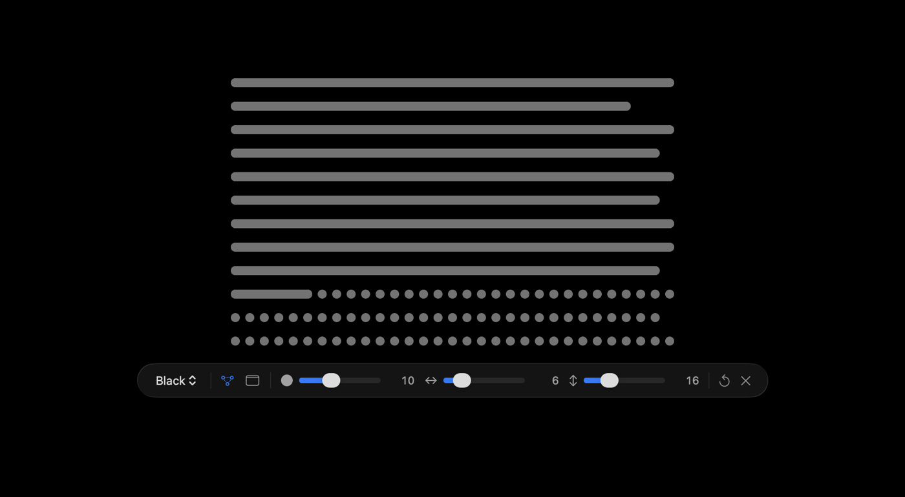

# Yearwall

A macOS menu bar app that turns the year into your wallpaper. Every day of the year is a
dot, months are rows, and the days already gone are joined into a line. The picture is
redrawn at midnight, so the line grows by one dot a day.



- Lives in the menu bar, no Dock icon.
- Renders at each display's real resolution and follows light and dark mode.
- Redraws at midnight, after sleep, when displays change and when you switch Spaces.
- Updates itself from GitHub releases once a day.
- No analytics, no accounts. The only network request is the update check.

Requires macOS 14 or later, on Apple silicon or Intel.

## Install

1. Download `Yearwall-<version>.zip` from the [latest release](https://github.com/krllb/yearwall/releases/latest).
2. Unzip it and move `Yearwall.app` to `/Applications`.
3. The app is not notarized, so open it the first time with right-click → Open. Or run:

   ```sh
   xattr -dr com.apple.quarantine /Applications/Yearwall.app
   ```

After that, updates install by themselves.

## Use

Click the grid icon in the menu bar:

- **Settings…** clears the desktop and puts a settings bar right under the grid, so you
  tune the wallpaper you are looking at. Click anywhere else, or press Esc, to close it.
- **Refresh Now** redraws the wallpaper.
- **Launch at Login** starts Yearwall with your Mac.
- **Check for Updates…** checks right away instead of waiting a day.

In the settings bar:

| Control | What it does |
| --- | --- |
| Theme | Black, Paper, Deep, Terracotta or Classic 95 |
| Join elapsed marks | Draws the days already gone as one line per month instead of separate dots |
| Black menu bar | Paints the strip under the menu bar black, so a bright theme does not tint it |
| Mark size | Dot diameter, in points |
| Column and row gaps | Space between days and between months, in points |
| Reset | Puts the grid numbers back to the defaults |

## Updates

Once a day Yearwall looks at the latest release of this repository. When a newer version is
out, it downloads the archive, checks it against the SHA-256 digest GitHub publishes for
it, makes sure it is the same app with the expected version, replaces itself and
relaunches. It waits while the settings bar is open.

The app has to sit in a folder you can write to, such as `/Applications` on an admin
account. Logs, including update checks, go to `~/Library/Logs/Yearwall.log`.

## Build from source

Needs Xcode 26 or its command line tools.

```sh
swift run                          # run from the terminal, no app bundle
swift test                         # 134 tests
Scripts/make-app.sh                # build/Yearwall.app (Launch at Login and updates need it)
open build/Yearwall.app
```

Helpers that do not touch the desktop:

```sh
swift run Yearwall --report        # screen geometry and the wallpaper each screen shows
swift run Yearwall --preview --theme paper --appearance light --out /tmp/year.png
swift Scripts/make-icon.swift      # redraw Resources/AppIcon.icns
```

## Releasing

Push a version tag:

```sh
git tag v0.2.0 && git push origin v0.2.0
```

The release workflow runs the tests, builds a universal app stamped with that version and
publishes `Yearwall-0.2.0.zip` as a GitHub release. Installed copies pick it up within a day.

## How it works

Rendering is a pure function of the settings, the date and the display, so the same day
always produces the same image. How the modules fit together, how seeding works, and what
macOS actually does with wallpapers and Spaces is written up in
[docs/ARCHITECTURE.md](docs/ARCHITECTURE.md).
